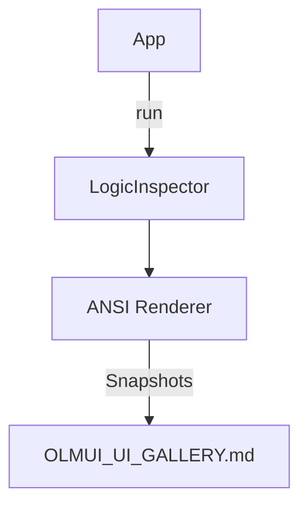

# Seed: @nan0web/ui-cli (Visual Verification)

## 1. Сутність та Мета
Створення детермінованої системи CLI-Snapshot-тестування. Мета — мати візуальне підтвердження кожного кроку термінального діалогу для різних локалей та вхідних даних (Golden Master pattern).

## 2. Model-as-Schema (Схема Даних)
- `LogicInspector`: Захоплює потік CLI-інтенцій.
- `VisualAdapter` (CLI/ANSI): Перетворює репліки у ANSI-блоки.

## 3. Каркас Роботи (Діаграма)

## 4. Генератор (Flow)
1. progress: Ініціалізація `CLI-Adapter`
2. ask: Виклик `Input/Select/Autocomplete`
3. log: Рендеринг `Alert/Table`
4. result: Вихід

## 5. User Stories
- Як розробник, я бачу "фотографію" терміналу для кожного кроку логіки.
- Як архітектор, я гарантую 100% відповідність CLI-інтерфейсу бізнес-сценаріям.
