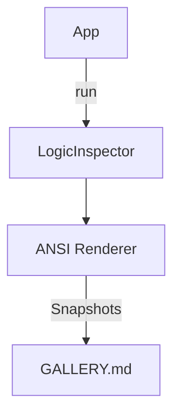

# Seed: @nan0web/ui-cli

## 1. Сутність та Мета
Створення детермінованої системи CLI-Snapshot-тестування та інтерактивних інтерфейсів у терміналі. Мета — мати візуальне підтвердження кожного кроку діалогу (Golden Master) та забезпечити зручну навігацію по контенту без виходу з CLI.

## 2. Технічні Досягнення

### 2.1. DRY CLI & Recursive Parsing
Виправлено алгоритм інстанціювання підкоманд (метод `_instantiateSubCommand`). Раніше він міг крашитися, якщо `options` містили звичайні рядки замість класів. 

Тепер `modelFromArgv.js` рекурсивно сканує всі підкоманди. Це дозволяє уникнути дублювання схем (напр. `--project`, `--force`) у батьківських моделях — парсер автоматично бачить параметри підмоделей "з коробки".

	### 2.2. CLI Mount Protocol & Database-Agnostic Entry
`nan0cli` підтримує декларативне монтування баз даних через CLI-прапорці (наприклад, `--mount-data redis://localhost`/`--mount-app ./src`). 
Це дозволяє відв'язати інфраструктуру (звідки брати дані та код) від самого додатку. Кожен CLI-виклик є абсолютно ізольованим, а DSN-парсинг під капотом резолвить потрібний адаптер (`@nan0web/db-fs`, `@nan0web/db-redis` тощо), роблячи виконання Data-Driven.

### 2.3. Архітектура Візуальної Верифікації
- **LogicInspector**: Захоплює потік CLI-інтенцій для детермінованого тестування.
- **VisualAdapter (CLI/ANSI)**: Перетворює репліки у ANSI-блоки для збереження у зліпки (Snapshots).

## 3. План розвитку: Interactive Content Viewer

Створення компонента `ContentViewer` для рендерингу Markdown/YAML-AST прямо в терміналі з підтримкою інтерактивності:

### 3.1. ContentViewer (Interactive Layout)
* **Left-Gutter**: Відступи зліва для індикаторів типу контенту (H1, p, hr).
* **Скролинг**: Навігація клавішами ⬆/⬇ з Word-Wrap по ширині терміналу.
* **Footer**: Статус-рядок з прогресом читання `[ 45% ]` та гарячими клавішами.

### 3.2. Фокусна навігація та Inline Forms
* **Фокус**: Перемикання між посиланнями (`$href`) та кнопками всередині тексту через Tab або ⬅/➡.
* **Inline Forms**: Рендеринг вбудованих моделей (напр. форми зворотного зв'язку) без зміни контексту. При активації поля ContentViewer "призупиняється", даючи можливість заповнити дані, і повертає фокус після завершення.

## 4. User Stories
- Як розробник, я бачу "фотографію" терміналу для кожного кроку логіки у `GALLERY.md`.
- Як користувач, я можу читати документацію та заповнювати форми в єдиному CLI-інтерфейсі так само зручно, як у браузері.

## 5. Pluggable Navigation (Isolated Plugin DBs)

В архітектурі **One Logic — Many UIs (OLMUI)** навігація не хардкодиться. Додатки-плагіни (наприклад, `Search`, `Language Switcher`) можуть інжектувати власні пункти меню у головну навігацію.

**Правила впровадження (Model-as-Schema + DBFS):**
1. **Плагін як App:** Плагін — це повноцінний `App`, який має власну ізольовану базу даних (`pluginApp.db`).
2. **Ізольований Файл Розширення:** Кожен плагін експортує свої пункти навігації у файлі `data/extensions/nav.nan0`. Оскільки бази ізольовані, файл може містити звичайний масив (наприклад, `[ { label: 'Search', priority: 10 } ]`), і він не буде затертий іншими плагінами під час `Data.merge`.
3. **App Shell Discovery:** Основна оболонка ітерується по списку зареєстрованих плагінів (`this.options.plugins`), витягує `extensions/nav` з кожної БД плагіна (`pluginApp.db.fetch('extensions/nav')`) і конкатенує їх у пам'яті.
4. **Вставка за Пріоритетом (Priority & Target):** Зібрані розширення зливаються з основними пунктами меню і сортуються за ключем `priority` (або групуються за `target`). Це дозволяє плагінам вставляти себе на початок, в кінець, або навіть посередині головного меню без модифікації ядра.
